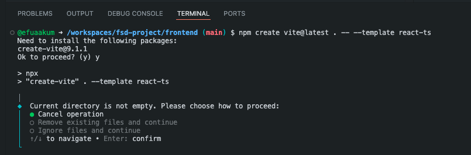

# Full-Stack Application

## Folder structure
```
my-project/
├── api/
│   ├── src/
│   ├── pom.xml 
│   └── Dockerfile
├── frontend/
│   ├── src/
│   ├── package.json
│   ├── vite.config.ts
│   └── Dockerfile
└── docker-compose.yml
```

### API: Spring Boot (Java 25) Dockerfile
This build uses Eclipse Temurin JDK 25 to compile a Maven-based project, then copies the compiled JAR into a lightweight JRE 25 runtime image.

### Frontend: React Vite TS Dockerfile
It uses Node to compile the static assets, then serves them using a highly performant __Nginx__ server configured for single-page applications (SPA routing).

To make sure routing works properly (preventing 404s when hard-refreshing nested routes in React) added an `nginx.conf` file.

### Orchestration: docker-compose.yml
This orchestrates all three services, setting up local networking, persistent database volumes, and startup dependency orders.

## Building the API

Run the following command from your root folder `fsd-project` directory. It queries the Spring Initializr API, generates the Java 25 project, downloads it, and extracts it directly into an exisiting `/api` folder:

```bash
  curl -G -L https://start.spring.io/starter.tgz \
  -d dependencies=web,mysql \
  -d javaVersion=25 \
  -d type=maven-project \
  -d groupId=com.example \
  -d artifactId=api \
  -d name=api | tar -xzvf - -C ./api
```

### What is this command doing?:
- `dependencies=web,mysql`: Pulls in Spring Web (for your REST API endpoints) and the MySQL Driver (to talk to your database).

- `javaVersion=25`: Configures the compiler and build properties for Java 25.

- `type=maven-project`: Creates a Maven-structured app (matching the pom.xml build we set up in our Dockerfile).

- `baseDir=api | tar -xzvf`: Unpacks the zipped contents cleanly into /api without leaving any messy zip files behind.

- `-C ./api`: Tells tar to extract the downloaded files directly inside your existing api directory.

- __Non-destructive__: It will extract the Spring Boot files around your existing api/Dockerfile without overwriting it (unless you happen to already have a file named `pom.xml` or `src/` in there, in which case those specific files would be overwritten).

## Set-by-Step Vite TS installation

1. Navigate to your root project directory (`fsd-project/`), and step into the `frontend/` directory:

```bash
cd frontend
```

2. Run the following command to scaffold the Vite React-TS template into the current directory

```bash
npm create vite@latest . -- --template react-ts
```

⚠️ __Note__: Vite will notice that your `Dockerfile` and `nginx.conf` are already in the folder and will ask:
```
Current directory is not empty. Please choose how to proceed:
❌ Cancel operation
❌ Remove existing files and continue
✅ Ignore files and continue"
```
Select: `Ignore files and continue`



3. Now that the `package.json` file has been generated, install all the initial React and TypeScript dependencies:

```bash
npm install
```

## Running the solution
Run the following command 

```bash
docker compose up --build
```