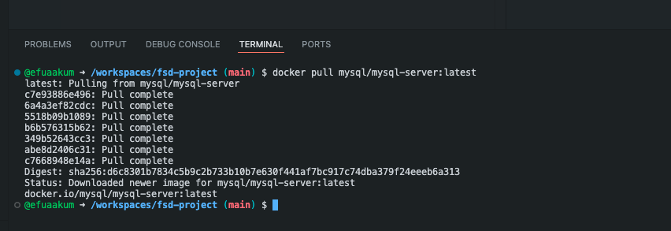

# Full-stack Application

## Windows Installation Steps:
- Install Git
- Install/Update WSL
- Download and install docker
- Install VSCode Container Tools extension from Microsoft

## Download the MySQL Server Docker Image

```bash
docker pull mysql/mysql-server:latest
```

